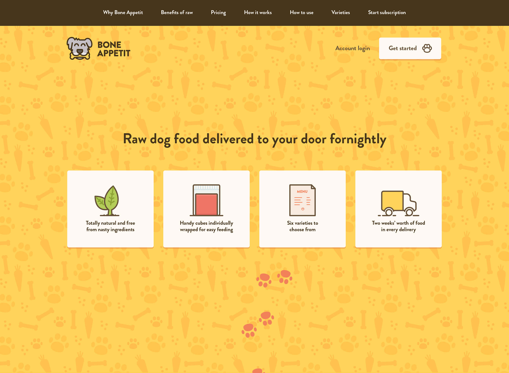

<Screen device="small">

  

</Screen>
<Screen device="medium">

  

</Screen>

## Where do you start when there’s nothing?
Initially, there wasn’t a name for the company let alone branding. All of this had to be considered before getting into the design of the website. The main question that was asked, was how do potential customers trust this product?

### It has to be a friendly and approachable product
Looking at the various brands out there they take two approaches: more friendly than clinical or more clinical than friendly. 

I felt a more clinical approach could come across cold an unapproachable for a new product. As the more minimal brands can have science to back their product, which works for them.

## A cube of raw food in a handy package
The main selling point of the product was its ease of use.

More to come…

