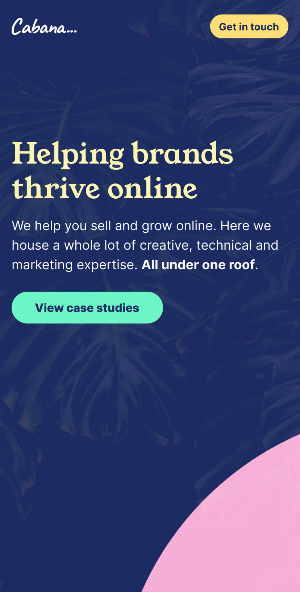
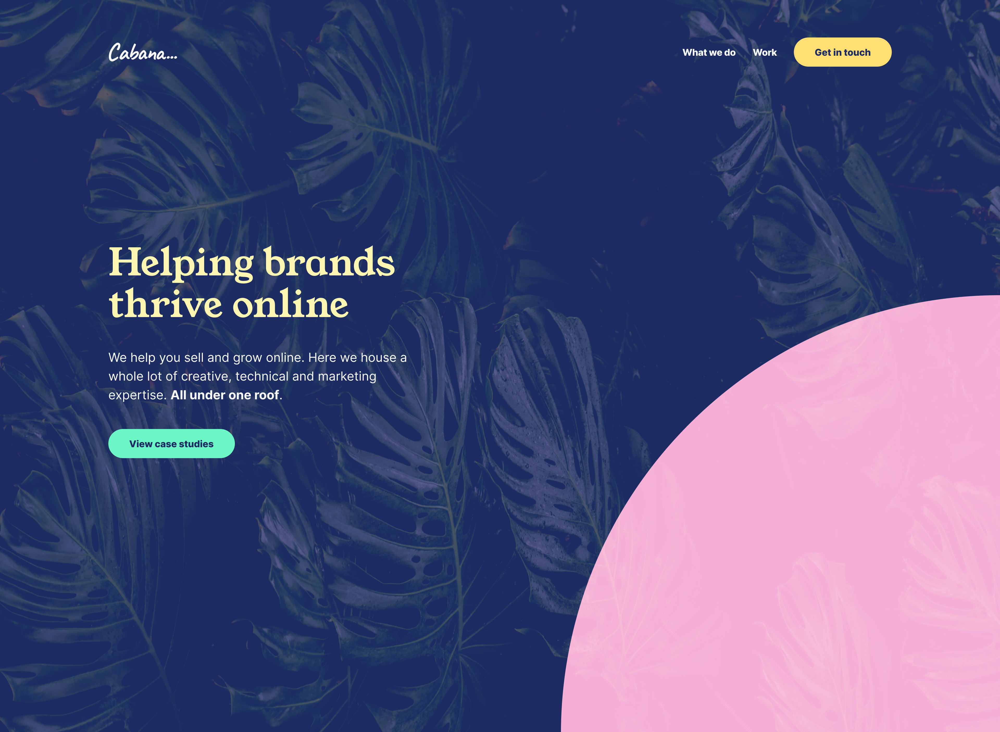
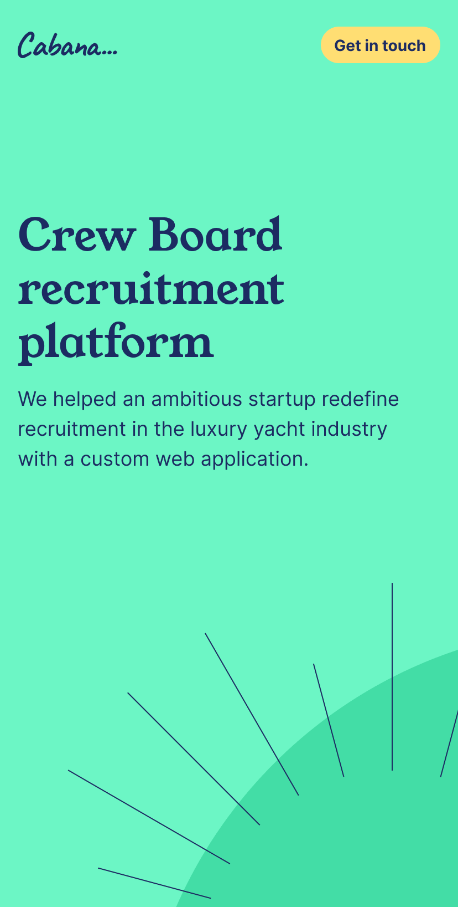

<Screen device="small" className="snap-start">

  

</Screen>
<Screen device="medium" className="snap-start">

  

</Screen>

## Empowering the experts
With Cabana we worked together to get the structure.

<Screen device="small" className="snap-start">

  

</Screen>
<Screen device="small" className="snap-start">

</Screen>
<Screen device="small" className="snap-start">

</Screen>
<Screen device="small" className="snap-start">

</Screen>

More to come…

