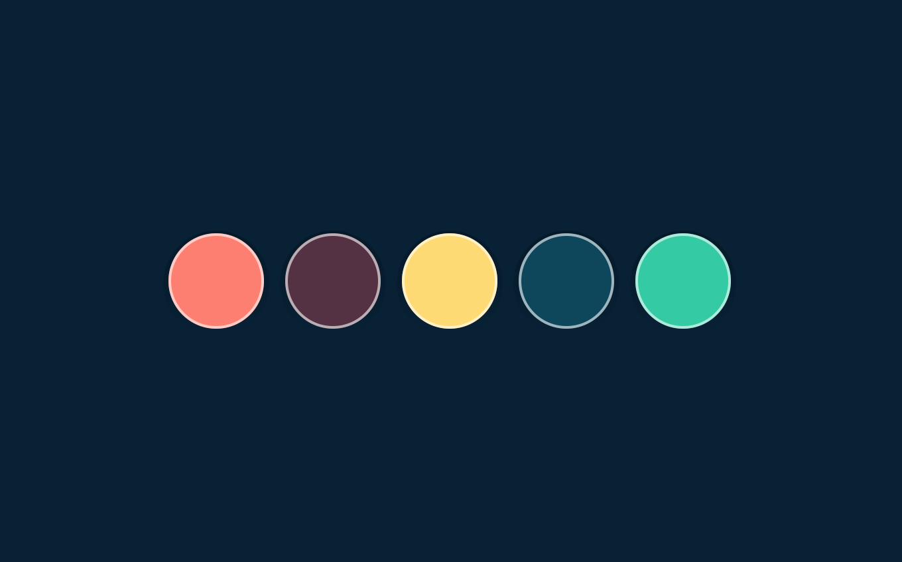

import Story from "@components/card/story";
import Screen from "@components/screen";
import H from "@components/content/h";
import List from "@components/content/list";
import P from "@components/content/p";

<Screen device="small" className="snap-start">

  

</Screen>
<Screen device="medium" className="snap-start">

  

</Screen>

## Understanding the visitors
It’s important to understand the frame of mind people are in whilst looking for solutions in articles. So throughout the process I wanted to keep this in mind.

### Time is the main factor
There are two main types of people who visit this website. Those who are currently working and those who are learning.

**The distinction between the two is the time they have**. The person working wants a quick solution and the person learning wants to be guided and understand much of the why.

  <Story className="col-span-8 lg:col-span-4">
    <svg
      className="mdMax:mt-8 mb-8 md:mb-16"
      width="128"
      height="10"
      fill="none"
      strokeWidth={2}
      pathLength={1}
      stroke="#7DB8CA"
    >
      <path d="M0 1C3.99937 1 3.99937 9 7.99875 9C11.9981 9 11.9981 1 15.9975 1C19.9969 1 19.9969 9 23.9962 9C27.9956 9 27.9956 1 31.995 1C35.9944 1 35.9944 9 39.9937 9C43.9931 9 43.9931 1 47.9925 1C51.9919 1 51.9919 9 55.9912 9C59.9906 9 59.9906 1 63.99 1C67.9894 1 67.9894 9 71.9887 9C75.9881 9 75.9881 1 79.9875 1C83.9869 1 83.9869 9 87.9862 9C91.9856 9 91.9856 1 95.985 1C99.9844 1 99.9844 9 103.984 9C107.983 9 107.983 1 111.982 1C115.982 1 115.982 9 119.991 9C124.001 9 123.991 1 128 1" />
    </svg>
    <H as="h3">I’m working</H>
    
I’m currently working on a project and in a hurry to find a solution to the problem. I want to skim the article, grab the solution and get back to what I’m doing.

    <List
      items={[
        "When I’m stuck I want to find the solution quickly within the article.",
        "I want to trust when I copy code or values it’s the complete solution.",
        "When I’m using a tool in an application, I want to know where it is without having to spend time hunting for it."
      ]}
    />
  </Story>
  <Story className="col-span-8 lg:col-span-4">
    <svg
      className="mdMax:mt-8 mb-8 md:mb-16"
      width="128"
      height="10"
      fill="none"
      stroke="#7DB8CA"
      strokeWidth={2}
      pathLength={1}
    >
      <path d="M0 1c10.67 0 10.67 8 21.33 8C32 9 32 1 42.66 1 53.33 1 53.33 9 64 9s10.67-8 21.33-8C96 1 96 9 106.66 9c10.66 0 10.67-8 21.34-8" />
    </svg>
    <H as="h3">I’m learning</H>
    
I’ve heard of this particular topic, I’d like to research and learn more about the topic. I’ll search for tutorials on this topic.

    <List
      items={[
        "When I’m trying to improve my skills, I want to understand a topic fully, so I can recall it easier when I’m working.",
        "When I’m trying to improve my skills, I want to know why something is done this way, so I can form my own opinions.",
        "When I’m using a new tool I want to know where it is, not only the keyboard shortcut."
      ]}
    />
  </Story>

## Understanding the workflow behind content
There was a reasonable amount of articles already on the website—so a workflow is in place. I wanted to see where I could make the design of articles better without increasing workload.

With the majority of articles being tutorial based and few being the occasional essay, you don’t want to make things take longer. Consistent publishing is about having the least amount of friction in the way of hitting publish.

### Improve the design and aim to increase efficiency
Each post has various assets associated with it. From application images, code samples, keyboard shortcuts and references to name a few things.

These things take time to gather and produce on top of an article alone. These extra details are aren’t only necessary but improve engagement and understanding.

<Screen device="small" className="snap-start">

</Screen>
<Screen device="medium" className="snap-start">

</Screen>

## A vibrant & flexible set of colours
Starting out, laying the foundations for producing content and addressing the primary goal is the colour palette.

The aim is to be flexible and remain complementary. I wanted to give  variety in hues, tints and shades so that featured images and illustrations had enough freedom.

## Custom pixel perfect icons
With the illustrations throughout the website having particular stylistic choices (eg: stroke weight) it made sense that the icons followed suit.

All illustrations are drawn with 2px rounded strokes, so this was the main constraint to adhere to. Each icon is drawn on a 16px grid, being implemented in such a way the colour can be adjusted easily in code.

## Bold & clear typography, with enough white space
For the design of articles, people reading or scanning articles will benefit from a clear visual hierarchy & lack of distractions. Along with generous spacing to help create areas for the eyes to find a break. 

<Screen device="small" className="snap-start">

</Screen>
<Screen device="medium" className="snap-start">

</Screen>
<Screen device="small" className="snap-start">

</Screen>
<Screen device="medium" className="snap-start">

</Screen>

Headings are treated like a table of contents—in effect—denoting a new chapter. You can also click the icon next to these headings to grab a link to them.

### It doesn’t stop at design
Design defines a lot of the harmony found within articles, but it goes beyond typography and spacing. It’s up to the creation of content to maintain that experience.

I defined ways to create a more unified feel between list pages & articles themselves efficiently.

- Use the same sizing for featured & in article images
- Even if the image could feasibly take up less space
- Use light shades of the colour palette for featured image backgrounds
- Aim to use one or two distinct colours within featured images
- Set up templates to save having to refer to image sizes & colour

Some of these things appear simple, but it was a challenge to define appropriate sizing for each element. So that it remained in harmony throughout the design.

<Screen device="small" className="snap-start">

</Screen>

<Screen device="medium" className="snap-start">

</Screen>

## Results
The design wasn’t just a massive visual improvement, it was a restructuring and refocusing of a website that balanced two competing goals. Focusing on the writing side of the website saw the following:

  <Story className="col-span-5">
    <H as="h4" className="text-jasmine mb-2">Newsletter growth</H>
    
The newsletter grew from 0 to 587 subscribers within a year

  </Story>

  <Story className="col-span-5">
    <H as="h4" className="text-jasmine mb-2">Visits increased</H>
    
Traffic trebled <a href="https://iamsteve.me/blog/entry/a-year-in-writing-2017#website-year-in-review">year on year</a> every month for at least a year

  </Story>

  <Story className="col-span-5">
    <H as="h4" className="text-jasmine mb-2">Site speed improved</H>
    
Making use of modern techniques for loading acheives ~3s on 3G load times.

  </Story>

  <Story className="col-span-5">
    <H as="h4" className="text-jasmine mb-2">More pages viewed</H>
    
Visitors viewed more pages per session increasing from 1.4 to 2

  </Story>

### Features
- The website was saw a few submissions to user generated galleries like [Site Inspire](https://www.siteinspire.com/websites/7248-iamsteve),  [HeaderLove](https://headerlove.com/i-am-steve/) and [Best Website Gallery](https://bestwebsite.gallery/sites/sotd/2017/04/27/i-am-steve)
- Article featured in [CSS News](https://csslayout.news/issues/32)
- Article featured in [HeyDesigner](https://heydesigner.com/?s=get+up+to+speed+with+css+shapes)
- Articles featured on Awwwards, [1](https://www.awwwards.com/inspiration/how-to-use-kerning-and-tracking) and [2](https://www.awwwards.com/inspiration/creating-a-horizontal-responsive-menu)
