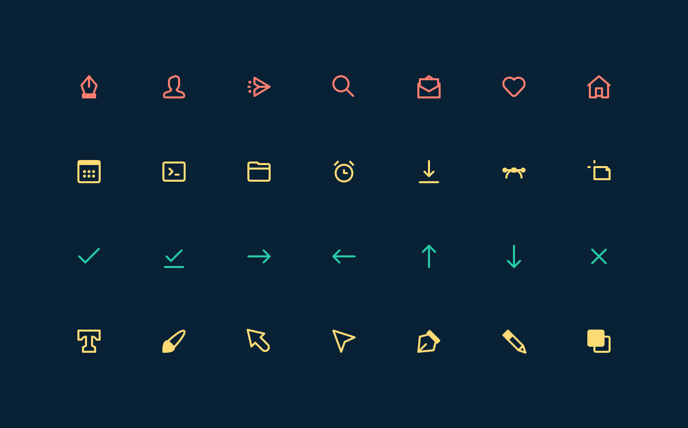
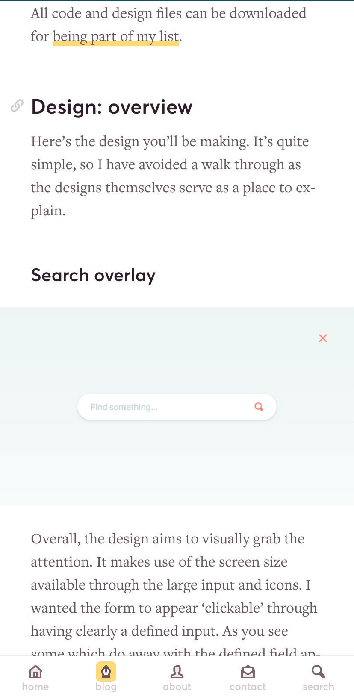

import Story from "@components/card/story";
import Screen from "@components/screen";
import H from "@components/content/h";
import List from "@components/content/list";
import P from "@components/content/p";

<Screen device="small">

  

</Screen>
<Screen device="medium">

  

</Screen>

## Understanding the visitors
It’s important to understand the frame of mind people are in whilst looking for solutions in articles. So throughout the process I wanted to keep this in mind.

### Time is the main factor
There are two primary types of people who visit this website. Those who are currently working and those who are learning.

**The distinction between the two is the time they have**. The person working wants a quick solution and the person learning wants to be guided and understand why.

  <Story className="col-span-5">
    <svg width={128} height={10} viewBox="0 0 128 10" fill="none" className="mb-16 stroke-animation">
      <path
        d="M0 1c4 0 4 8 7.999 8 4 0 4-8 7.999-8 3.999 0 3.999 8 7.998 8 4 0 4-8 7.999-8 4 0 4 8 7.999 8 4 0 4-8 7.998-8 4 0 4 8 8 8 3.999 0 3.999-8 7.998-8 4 0 4 8 7.999 8 4 0 4-8 7.998-8 4 0 4 8 8 8 3.999 0 3.999-8 7.998-8 4 0 4 8 7.999 8 3.999 0 3.999-8 7.998-8 4 0 4 8 8.009 8 4.01 0 4-8 8.009-8"
        stroke="#7DB8CA"
        strokeWidth={2}
        strokeMiterlimit={10}
        pathLength={1}
      />
    </svg>
    <H as="h3">I’m working</H>
    
I’m currently working on a project and in a hurry to find a solution to the problem. I want to skim the article, grab the solution and get back to what I’m doing.

    <List
      items={[
        "When I’m stuck I want to find the solution quickly within the article.",
        "I want to trust when I copy code or values it’s the complete solution.",
        "When I’m using a tool in an application, I want to know where it is without having to spend time hunting for it."
      ]}
    />
  </Story>
  <Story className="col-span-5">
    <svg width={128} height={10} viewBox="0 0 128 10" fill="none" className="mb-16 stroke-animation">
      <path
        d="M0 1c10.67 0 10.67 8 21.33 8C32 9 32 1 42.66 1 53.33 1 53.33 9 64 9s10.67-8 21.33-8C96 1 96 9 106.66 9c10.66 0 10.67-8 21.34-8"
        stroke="#7DB8CA"
        strokeWidth={2}
        strokeMiterlimit={10}
        pathLength={1}
      />
    </svg>
    <H as="h3">I’m learning</H>
    
I’ve heard of this particular topic, I’d like to research and learn more about the topic. I’ll search for tutorials on this topic.

    <List
      items={[
        "When I’m trying to improve my skills, I want to understand a topic fully, so I can recall it easier when I’m working.",
        "When I’m trying to improve my skills, I want to know why something is done this way, so I can form my own opinions.",
        "When I’m using a new tool I want to know where it is, not only the keyboard shortcut."
      ]}
    />
  </Story>

## Understanding the workflow behind content
There was a reasonable amount of articles already on the website—so a workflow is in place. I wanted to see where I could make the design of articles better without increasing workload where possible.

They are very much tutorial led, with the occasional essay.

### Improve the design and aim to increase efficiency
Each post has various assets associated with it. From application images, code samples, keyboard shortcuts and references to name a few things.

These things take time to gather and produce on top of an article alone. However, it’s important to add these extra details—they aren’t only necessary but improve engagement.

<Screen device="small">

</Screen>
<Screen device="medium">

</Screen>

## A vibrant & flexible set of colours
Starting out, laying the foundations for producing content and addressing the primary goal is the colour palette.

The aim is to be flexible and remain complementary. I wanted to give  variety in hues, tints and shades so that featured images and illustrations had enough freedom.

## Custom pixel perfect icons
With the illustrations throughout the website having particular stylistic choices (eg: stroke weight) it made sense that the icons followed suit.

All illustrations are drawn with 2px rounded strokes, so this was the main constraint to adhere to. Each icon is drawn on a 16px grid, being implemented in such a way the colour can be adjusted easily in code.

## Bold & clear typography, with enough white space
For the design of articles, people reading or scanning articles will benefit from a clear visual hierarchy & lack of distractions.

<Screen device="small">

</Screen>
<Screen device="medium">

</Screen>
<Screen device="small">

</Screen>
<Screen device="medium">

</Screen>

Headings are treated like a table of contents—in effect—denoting a new chapter. You can also click the icon next to these headings to grab a link to them.

### It doesn’t stop at design
Design defines a lot of the harmony found within articles, but it goes beyond typography and spacing. It’s up to the creation of content to maintain that experience.

I defined ways to create a more unified feel between list pages & articles themselves efficiently.

- Use the same sizing for featured & in article images
- Even if the image could feasibly take up less space
- Use light shades of the colour palette for featured image backgrounds
- Aim to use one or two distinct colours within featured images
- Set up templates to save having to refer to image sizes & colour

Some of these things appear simple, but it was a challenge to define appropriate sizing for each element. So that it remained in harmony throughout the design.

<Screen device="small">

</Screen>

<Screen device="medium">

</Screen>

## Results
The design wasn’t just a massive visual improvement, it was a restructuring and refocusing of a website that balanced two competing goals. Focusing on the writing side of the website saw the following:

  <Story className="col-span-5">
    <H as="h3">Newsletter growth</H>
    
The newsletter grew from 0 to 587 subscribers within a year

  </Story>

  <Story className="col-span-5">
    <H as="h3">Monthly visits increased</H>
    
Traffic trebled <a href="https://iamsteve.me/blog/entry/a-year-in-writing-2017#website-year-in-review">year on year</a> every month for at least a year

  </Story>

  <Story className="col-span-5">
    <H as="h3">Site speed improved</H>
    
A Google web.dev score of 99 on the homepage, Adobe Fonts is -1.

  </Story>

  <Story className="col-span-5">
    <H as="h3">More pages viewed</H>
    
Visitors viewed more pages per session increasing from 1.4 to 2

  </Story>

### Features
- The website was saw a few submissions to user generated galleries like [Site Inspire](https://www.siteinspire.com/websites/7248-iamsteve)
- Article featured in [CSS News](https://csslayout.news/issues/32)
- Article featured in [HeyDesigner](https://heydesigner.com/?s=get+up+to+speed+with+css+shapes)
- Articles featured on Awwwards, [1](https://www.awwwards.com/inspiration/how-to-use-kerning-and-tracking) and [2](https://www.awwwards.com/inspiration/creating-a-horizontal-responsive-menu)
